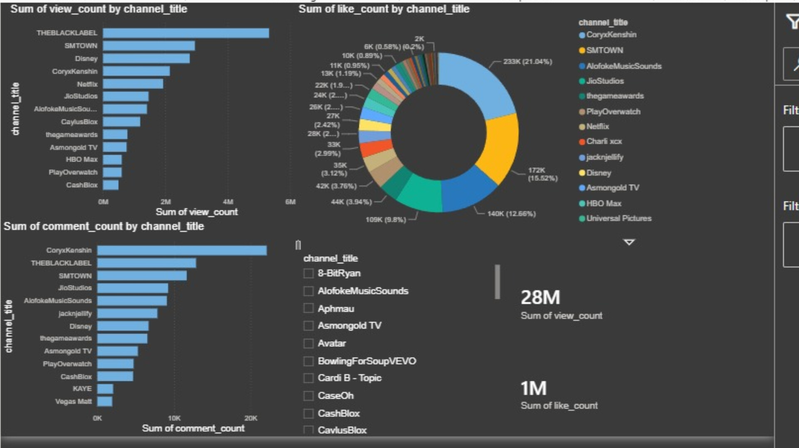
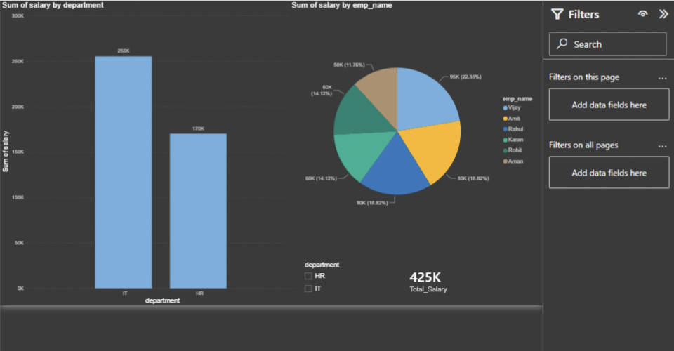

# Data-Analytics-Visual-Portfolio
Interactive Power BI dashboards covering YouTube Creator Analytics and Corporate HR Salary data.
# Data Analytics & Visualization Portfolio

Hi! I am a passionate Data Analyst specializing in Excel, SQL, and Power BI. Below are some of the interactive dashboards I have built to solve real-world data problems.

---

## 1. YouTube Content Creator Analytics Dashboard
This dashboard analyzes engagement metrics (Views, Likes, Comments) across top global YouTube channels to help marketing agencies understand audience retention.

### Key Metrics & Insights:
* **Total View Count:** 28M+ across analyzed creators.
* **Total Likes:** 1M+.
* **Core Insight:** Channels like *CoryxKenshin* show massive comment engagement relative to their view share, proving high fan loyalty compared to corporate channels like *THEBLACKLABEL*.
* **Tech Used:** Power BI (Data Visualization & Theme Design).

---

## 2. Employee Salary & HR Dashboard
A corporate HR dashboard designed to track salary distributions and headcount across various company departments.

### Key Metrics & Insights:
* **Total Payroll:** 425K.
* **Department Breakdown:** IT Department holds the highest salary share (255K) compared to HR (170K).
* **Tech Used:** Power BI (Slicers, KPI Cards, and Data Modeling).
